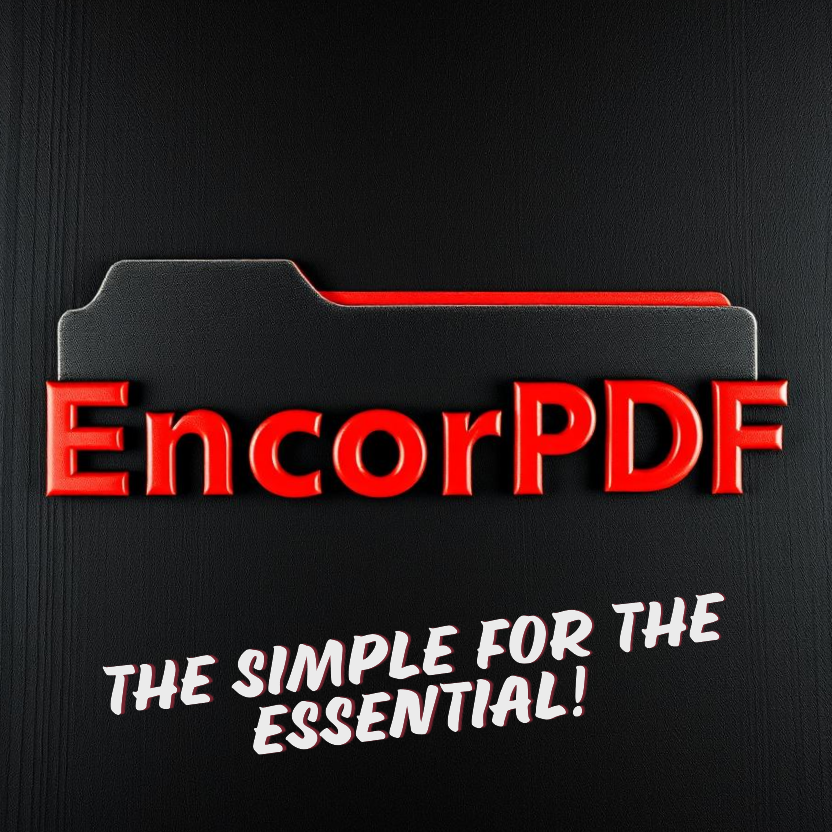
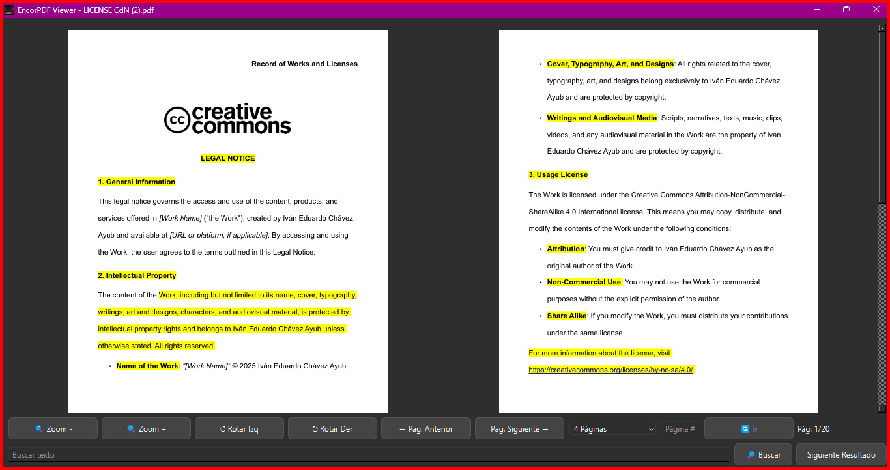

# EncorPDF Viewer
Developed by Iván Eduardo Chávez Ayub

**EncorPDF Viewer** is a versatile desktop application designed for viewing PDF files efficiently. Built using PyQt5, it provides a sleek and customizable interface to enhance user experience.

---

## Download
[Click here to download the EXE application from Google Drive (.zip)](https://drive.google.com/file/d/your-download-link)

For inquiries or feedback, contact me at: [sellocasadenubes@gmail.com](sellocasadenubes@gmail.com).

---

## Description
**EncorPDF Viewer** offers an intuitive way to view, navigate, and interact with PDF documents. With built-in zoom, multi-page layouts, and a theme designed for readability, it caters to both casual users and professionals.

---

## Features
- **Interactive Navigation:**
  - Easily move between pages with next, previous, and direct page input options.

- **Zoom Controls:**
  - Adjust zoom levels dynamically with dedicated buttons.

- **Multi-Page Layouts:**
  - Choose between 1, 2, or 4-page views for optimal readability.

- **Dark Theme:**
  - A modern dark interface to reduce eye strain.

- **Real-Time Rendering:**
  - Fast and smooth PDF rendering powered by PyMuPDF.

---

## How to Use
1. **Open a PDF File:**
   - Launch the application and select a PDF file via the file dialog.
2. **Navigate the Document:**
   - Use the arrow buttons or input a specific page number.
3. **Adjust Zoom:**
   - Click the zoom in/out buttons to modify the display size.
4. **Switch Layouts:**
   - Use the dropdown menu to toggle between single, dual, or quad-page views.
5. **Enjoy Seamless Viewing:**
   - Explore your PDF with an intuitive and responsive interface.

---

## System Requirements
- **Operating System:** Windows 10 or later.

---

## Application Structure
### User Interface (UI)
The PyQt5-based interface features:
- A central widget for rendering PDF pages.
- Navigation controls for page movement and zoom.
- A dropdown for layout switching.

### Core Modules
1. **Rendering Engine:** Utilizes PyMuPDF for high-speed PDF rendering.
2. **UI Controls:** Built with PyQt5 to ensure a responsive and accessible design.
3. **Theme Management:** Implements a consistent dark theme for all elements.

---

## Captures

---

## Development & Contribution
### Credits
This software leverages the following technologies:
- [PyMuPDF](https://pymupdf.readthedocs.io/en/latest/): For robust PDF rendering.
- [PyQt5](https://pypi.org/project/PyQt5/): For creating the graphical interface.

Special thanks to the open-source community for providing these invaluable tools.

### Contributions
We welcome contributions! To contribute:
1. Fork the repository.
2. Make your changes.
3. Submit a pull request.

---

Enjoy using **EncorPDF Viewer**! Your feedback is always appreciated to help us make the application even better.

