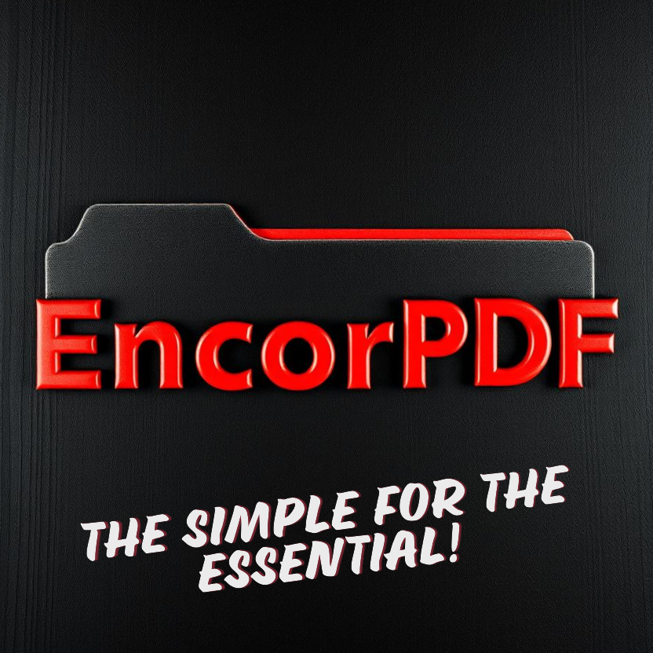

# EncorPDF Viewer

Desarrollado por Iván Eduardo Chávez Ayub

**EncorPDF Viewer** es una aplicación de escritorio versátil diseñada para visualizar archivos PDF de manera eficiente. Construida con PyQt5, ofrece una interfaz elegante y personalizable para mejorar la experiencia del usuario.

---

## Descargar

[Haz clic aquí para descargar la aplicación EXE desde Google Drive (.zip)](https://drive.google.com/file/d/your-download-link)

Para consultas o comentarios, contáctame en: [sellocasadenubes@gmail.com](sellocasadenubes@gmail.com).

---

## Descripción

**EncorPDF Viewer** ofrece una forma intuitiva de ver, navegar e interactuar con documentos PDF. Con funciones integradas como zoom, diseño multipágina y un tema diseñado para facilitar la lectura, está pensado tanto para usuarios casuales como para profesionales.

---

## Características

- **Navegación interactiva:**

  - Desplázate fácilmente entre páginas con opciones de siguiente, anterior e ingreso directo de número de página.

- **Controles de zoom:**

  - Ajusta los niveles de zoom dinámicamente con botones dedicados.

- **Diseños multipágina:**

  - Elige entre vistas de 1, 2 o 4 páginas para una mejor experiencia de lectura.

- **Tema oscuro:**

  - Interfaz moderna en modo oscuro para reducir la fatiga visual.

- **Renderizado en tiempo real:**
  - Renderizado rápido y fluido de PDF gracias a PyMuPDF.

---

## Cómo usar

1. **Abrir un archivo PDF:**
   - Inicia la aplicación y selecciona un archivo PDF mediante el cuadro de diálogo.
2. **Navegar por el documento:**
   - Usa los botones de flecha o ingresa un número de página específico.
3. **Ajustar el zoom:**
   - Haz clic en los botones de acercar/alejar para modificar el tamaño de visualización.
4. **Cambiar diseños:**
   - Usa el menú desplegable para alternar entre vistas de una, dos o cuatro páginas.
5. **Disfruta de una visualización fluida:**
   - Explora tu PDF con una interfaz intuitiva y receptiva.

---

## Requisitos del sistema

- **Sistema operativo:** Windows 10 o posterior.

---

## Estructura de la aplicación

### Interfaz de usuario (UI)

La interfaz basada en PyQt5 incluye:

- Un widget central para renderizar páginas PDF.
- Controles de navegación para el movimiento entre páginas y zoom.
- Un menú desplegable para cambiar el diseño de páginas.

### Módulos principales

1. **Motor de renderizado:** Utiliza PyMuPDF para un renderizado rápido de PDFs.
2. **Controles de UI:** Construidos con PyQt5 para asegurar un diseño receptivo y accesible.
3. **Gestión de temas:** Implementa un tema oscuro consistente en todos los elementos.

---

## Capturas

---

## Desarrollo y contribuciones

### Créditos

Este software utiliza las siguientes tecnologías:

- [PyMuPDF](https://pymupdf.readthedocs.io/en/latest/): Para un renderizado robusto de PDFs.
- [PyQt5](https://pypi.org/project/PyQt5/): Para crear la interfaz gráfica.

Agradecimientos especiales a la comunidad de código abierto por proporcionar estas herramientas invaluables.

### Contribuciones

¡Las contribuciones son bienvenidas! Para contribuir:

1. Haz un fork del repositorio.
2. Realiza tus cambios.
3. Envía una pull request.

---

¡Disfruta usando **EncorPDF Viewer**! Tus comentarios siempre son bienvenidos para ayudarnos a mejorar la aplicación.

---
