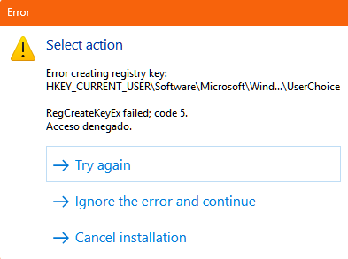

# EncorPDF Viewer

Desarrollado por Iván Eduardo Chávez Ayub

**EncorPDF Viewer** es una aplicación de escritorio versátil diseñada para visualizar archivos PDF de manera eficiente. Construida con PyQt5, ofrece una interfaz elegante y personalizable para mejorar la experiencia del usuario.


## Descargar

[Haz clic aquí para descargar la aplicación EXE desde Google Drive (.zip)](https://drive.google.com/file/d/1uJ-vlT_PdXx6s9G17OtJrR7Z-6Ll5C00/view?usp=sharing)


## Problema durante la instalación

Al instalar la aplicación, es posible que aparezca el siguiente error:

```
Error creating registry key HKEY_CURRENT_USER\Software\EncorPDF; code 5
Acceso denegado.
```



Cuando esto ocurra, verás tres opciones:

- **Try again**  
- **Ignore the error and continue**  
- **Cancel installation**

Selecciona la opción **"Ignore the error and continue"** y sigue los pasos para completar la instalación sin problemas.

Para consultas o comentarios, contáctame en: [sellocasadenubes@gmail.com](sellocasadenubes@gmail.com).

---

## Requisitos del sistema

- **Sistema operativo:** Windows 10 o posterior.

---

## Estructura de la aplicación

### Interfaz de usuario (UI)

La interfaz basada en PyQt5 incluye:

- Un widget central para renderizar páginas PDF.
- Controles de navegación para el movimiento entre páginas y zoom.
- Un menú desplegable para cambiar el diseño de páginas.

---

## Capturas


---

## Desarrollo

### Créditos

Este software utiliza las siguientes tecnologías:

- [PyMuPDF](https://pymupdf.readthedocs.io/en/latest/): Para un renderizado robusto de PDFs.
- [PyQt5](https://pypi.org/project/PyQt5/): Para crear la interfaz gráfica.

Agradecimientos especiales a la comunidad de código abierto por proporcionar estas herramientas invaluables.

### Contribuciones

¡Las contribuciones son bienvenidas! Para contribuir:

1. Haz un fork del repositorio.
2. Realiza tus cambios.
3. Envía una pull request.

---

¡Disfruta usando **EncorPDF Viewer**! Tus comentarios siempre son bienvenidos para ayudarnos a mejorar la aplicación.

---
