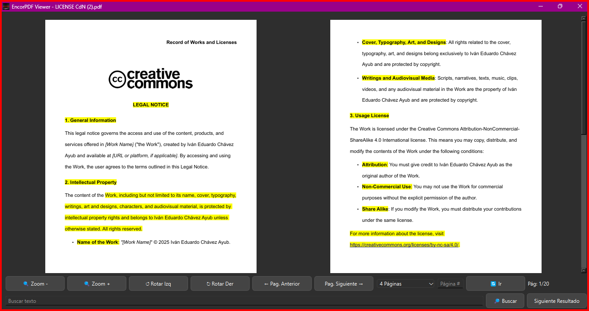

# Visor EncorPDF

Desarrollado por Iván Eduardo Chávez Ayub

**EncorPDF Viewer** es una aplicación de escritorio versátil diseñada para la visualización eficiente de archivos PDF. Construida con PyQt5, ofrece una interfaz elegante y personalizable para mejorar la experiencia del usuario.


## Descarga

[Haz clic aquí para descargar la aplicación EXE desde Google Drive (.zip)](https://drive.google.com/file/d/1dTKplwTzInqTGAkrG0aiial4PqrSJbcB/view?usp=sharing)

## Problema de Instalación

Durante la instalación, podrías encontrar el siguiente error:

```
Error creating registry key HKEY_CURRENT_USER\Software\EncorPDF; code 5
Access denied.
```


Cuando esto ocurra, verás tres opciones:

- **Reintentar**
- **Ignorar el error y continuar**
- **Cancelar la instalación**

Selecciona **"Ignorar el error y continuar"** y sigue con los pasos de instalación sin problemas.

Para preguntas o comentarios, contáctame en: [sellocasadenubes@gmail.com](mailto:sellocasadenubes@gmail.com).

---

## Cómo Usar

1. **Abrir un archivo PDF:**
   - Haz clic derecho en el archivo PDF que deseas abrir.
   - Selecciona "Abrir con" y elige **EncorPDF.exe** de la lista de aplicaciones disponibles.
   - Preferiblemente, selecciona la opción **"Elegir otra aplicación"**.
   - Luego, selecciona **EncorPDF.exe** de la lista y marca la opción **"Usar siempre esta aplicación para abrir archivos .pdf"** (o la opción equivalente en tu versión de Windows).

---

## Novedades de la Versión 2.0

La última versión de **EncorPDF Viewer** presenta nuevas características y mejoras emocionantes:

- **Exportar Páginas de PDF a PNG:**
  - Exporta fácilmente páginas individuales de un documento PDF como imágenes PNG de alta calidad.

- **Rotación de Páginas:**
  - Rota las páginas en sentido horario o antihorario según tu preferencia.

- **Visualización Mejorada de Múltiples Páginas:**
  - Diseño y funcionalidad mejorados para ver varias páginas simultáneamente.

- **Interfaz Gráfica Modernizada:**
  - Una interfaz renovada con mejor equilibrio de colores y un diseño más moderno.

Estas actualizaciones hacen que **EncorPDF Viewer 3.0** sea aún más potente y fácil de usar para una amplia gama de tareas.

---

## Requisitos del Sistema

- **Sistema Operativo:** Windows 10 o superior.

---

## Estructura de la Aplicación

### Interfaz de Usuario (UI)

La interfaz basada en PyQt5 incluye:

- Un widget central para renderizar páginas PDF.
- Controles de navegación para moverse entre páginas y hacer zoom.
- Un menú desplegable para cambiar los diseños de página.

---

## Capturas de Pantalla



---

## Desarrollo

### Créditos

Este software utiliza las siguientes tecnologías:

- [PyMuPDF](https://pymupdf.readthedocs.io/en/latest/): Para un renderizado robusto de PDFs.
- [PyQt5](https://pypi.org/project/PyQt5/): Para crear la interfaz gráfica.

Agradecimientos especiales a la comunidad de código abierto por proporcionar estas herramientas invaluables.

### Contribuciones

¡Las contribuciones son bienvenidas! Para contribuir:

1. Haz un fork del repositorio.
2. Realiza tus cambios.
3. Envía un pull request.

---

Disfruta usando **EncorPDF Viewer**. Tu retroalimentación siempre es bienvenida para ayudarnos a mejorar la aplicación.

---
